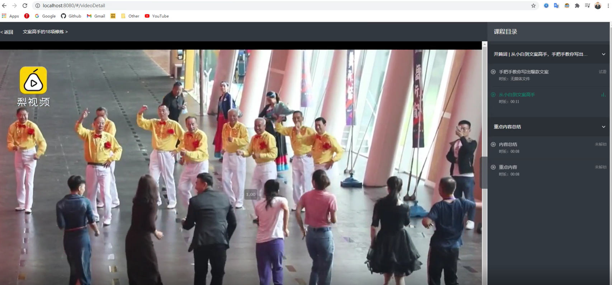

# MicroService

这个项目是2021年2月份做的一个微服务项目。

项目搭建的是一个教育平台的的PC站，根据[Martin Flower](https://martinfowler.com/articles/microservices.html)大师在他的文章中的描述：

> a particular way of designing software applications as suites of independently deployable services.

即：把一个单一的应用程序，拆分成一组独立的可拆分的微服务来单独运行，来解除不同模块间的耦合程度。

每个模块进行成为一个单独的进程，甚至可以使用分库，让每个微服务拥有其特有的数据库。

每个服务之间相互调用，相互配合，来为整个项目提供服务。

---

**Spring Boot**

下面是官网的一段文字

Spring Boot 简化了Spring FrameWork 的大量的xml配置。其基于约定优于配置的[(COC)](https://en.wikipedia.org/wiki/Convention_over_configuration)思想，大大加强了开发效率与代码审查效率。

---

**微服务项目后端架构**

| MODULE           | Description            | Port |
| ---------------- | ---------------------- | ---- |
| edu-lagou        | 父工程                 |      |
| edu-api          | 通用的公共子模块       |      |
| edu-comment-boot | 留言微服务             | 8005 |
| edu-course-boot  | 课程微服务             | 8002 |
| edu-eureka-boot  | Eureka做服务的注册中心 | 7001 |
| edu-gateway-boot | 网关微服务             | 9000 |
| edu-order-boot   | 订单微服务             | 8003 |
| edu-pay-boot     | 支付微服务             | 8004 |
| edu-user-boot    | 用户微服务             | 8001 |

---

**开发环境**

* JDk11.0.5
* Maven3.6.3
* CentOS7
* Docker
* Redis
* Spring Boot

**开发工具**

* IDEA 2019
* VSCode
* SqlYog 数据库客户端工具
* Redis Client   redis的客户端工具
* VM workstation
* Postman 接口测试工具

---

## 效果图

**接口测试**

**前端使用Vue来搭建**

**[前端视频播放采用阿里云视频点播方案](https://www.alibabacloud.com/help/zh/doc-detail/51236.htm?spm=a2c63.p38356.b99.2.28213799QTbeE3)**

**使用Redis来解决高并发下的缓存穿透问题**

`allCourse` 当课程界面显示频繁(首页面显示所有课程，用户返回也会重新查询所有课程)。使用Redis 来解决高并发下的缓存穿透的方式。设置redis 的key过期时间为10s。

在这10s内，第一个用户没有在缓存查到数据，去Mysql数据库来寻找当前的数据，之后10s内的相同请求都会在缓存中查询到数据。

同时，对于Mysql 我们也做了分库的改造，每个微服务都有其独立的数据库。

